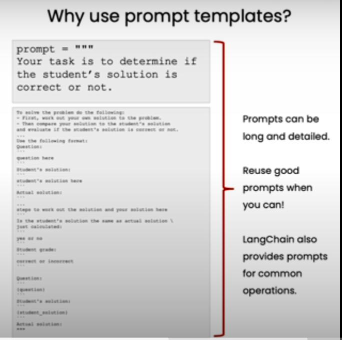

# LangChain + Google GenAI: Prompts, Models, and Parsers

This repository demonstrates how to use **LangChain** with **Google GenAI** to streamline workflows involving **prompts**, **models**, and **parsers**. It highlights how LangChain simplifies prompt engineering, integrates models, and structures LLM outputs for efficient use.

---

## Why Use Prompt Templates?

Prompt templates are a powerful alternative to using plain `f-strings` for creating LLM prompts.

### Key Benefits:

1. **Reusability**: Once created, templates can be reused across different tasks or workflows.
2. **Clarity**: Prompts are easier to read, maintain, and organize, even when they are long or complex.
3. **Modularity**: LangChain allows for dynamically injecting variables into templates, keeping your code clean and structured.



By using LangChain's `ChatPromptTemplate`, you avoid hardcoding prompts with `f-strings` and gain flexibility to build more dynamic workflows.

---

## Key Features

1. **Prompts**: Craft dynamic and reusable prompts for various use cases.
2. **Models**: Easily integrate LLMs like Google GenAI into your workflows.
3. **Parsers**: Parse unstructured model outputs into clean, structured formats (e.g., JSON or Python dictionaries).

---

## Code Highlights

### 1. **Dynamic Prompt Creation**

LangChain's `ChatPromptTemplate` simplifies crafting reusable prompts. Example:

```python
from langchain.prompts import ChatPromptTemplate

prompt_template = """
Your task is to determine if the student's solution is correct or not.

Question: {question}

Student's Solution: {student_solution}

Actual Solution: {actual_solution}

Is the student's solution the same as the actual solution? Yes or No.
"""

chat_prompt = ChatPromptTemplate.from_template(prompt_template)
formatted_prompt = chat_prompt.format_messages(
    question="What is 2 + 2?",
    student_solution="5",
    actual_solution="4",
)
response = call_llm(formatted_prompt[0].content)
print(response)
```

---

### 2. **Interacting with Models**

This repository uses `call_llm` to invoke Google GenAI, sending prompts and receiving outputs seamlessly. Example usage:

```python
response = call_llm(formatted_prompt[0].content)
print("Generated Response:", response)
```

---

### 3. **Parsing Structured Outputs**

LangChain enables extracting structured data (like JSON) from raw LLM responses using `ResponseSchema` and `StructuredOutputParser`.

#### Example:

```python
from langchain.output_parsers import ResponseSchema, StructuredOutputParser

# Define schemas for structured output
gift_schema = ResponseSchema(name="gift", description="Was the item purchased as a gift?")
delivery_days_schema = ResponseSchema(name="delivery_days", description="How many days did it take to arrive?")
price_value_schema = ResponseSchema(name="price_value", description="Extract price-related sentences.")

response_schemas = [gift_schema, delivery_days_schema, price_value_schema]
output_parser = StructuredOutputParser.from_response_schemas(response_schemas)

# Example prompt for parsing
review_template = """
For the following text, extract the following information:

{format_instructions}

text: {text}
"""
format_instructions = output_parser.get_format_instructions()
prompt = ChatPromptTemplate.from_template(review_template)
messages = prompt.format_messages(
    text="This leaf blower is amazing...",
    format_instructions=format_instructions,
)
response = call_llm(messages[0].content)
parsed_response = output_parser.parse(response)

# Access parsed fields
print("Gift:", parsed_response["gift"])
print("Delivery Days:", parsed_response["delivery_days"])
print("Price Value:", parsed_response["price_value"])
```

---

## Use Cases

- **Grading Systems**: Automatically evaluate student answers against correct solutions.
- **Review Analysis**: Extract structured insights (e.g., delivery time, sentiment) from unstructured reviews.
- **Workflow Automation**: Build dynamic workflows using reusable prompts and structured outputs.

---

LangChain allows you to move beyond basic LLM interactions, empowering you to build scalable, reusable, and structured workflows. Explore the code and see how prompts, models, and parsers can simplify your AI solutions!
