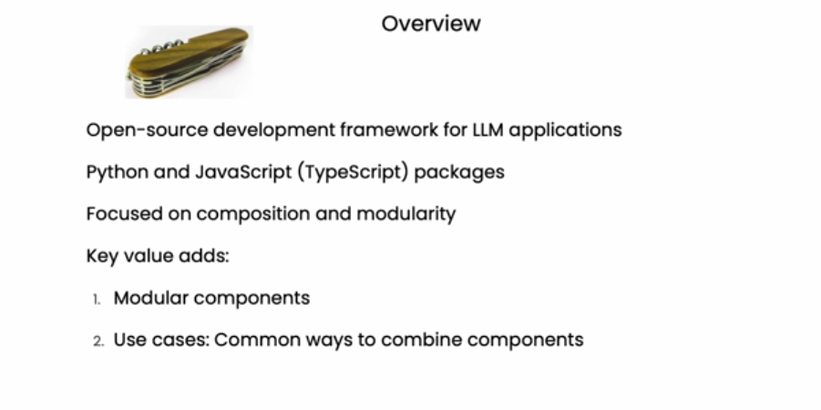

# LangChain



LangChain is an **open-source framework** designed for building powerful and scalable applications with Large Language Models (LLMs) like OpenAI's GPT or Google's Generative AI. It simplifies development by offering modular components, integration tools, and support for complex workflows.

---

## What is LangChain?

LangChain provides a structured way to build applications with LLMs, focusing on:

- **Modularity**: Reusable components for workflows.
- **Composition**: Combining tools like databases, APIs, and LLMs effortlessly.

It enables developers to move beyond simple LLM usage by providing a framework to integrate multiple systems and build more advanced AI-driven solutions.

---

## Why Use LangChain?

While you can use native SDKs like `google.generativeai` or `openai` for basic tasks, LangChain stands out when building complex applications due to:

1. **Integration Ease**: Combines LLMs, APIs, databases, and tools seamlessly.
2. **Reusable Components**: Encourages modular workflows, making scaling easier.
3. **Advanced Use Cases**: Enables functionality like:
   - Retrieval-Augmented Generation (RAG)
   - Memory for conversational agents
   - Custom data pipelines
4. **Ecosystem Support**: Includes pre-built integrations for popular tools, saving you time and effort.

---

## Why Not Just Use SDKs?

Using simple SDKs like `google.generativeai` or `openai` is fine for small tasks, but:

- **Scaling is Hard**: Complex workflows need significant manual effort.
- **No Reusability**: Rewriting code for different projects becomes a headache.
- **Integration Challenges**: SDKs don't help with combining external tools like vector databases, embeddings, or web scraping.

LangChain solves these challenges by providing a structured framework that makes advanced applications easy to build and maintain.

---

## What's in This Repository?

This repository is a **beginner-friendly resource** to get started with LangChain. You’ll find:

- Tutorials on LangChain basics.
- Example use cases for workflows.
- Guidance on integrating LangChain with tools like vector databases and LLMs.

---

## Installation

I recommend using a package manager like `poetry` or `uv` to manage your Python dependencies. Here’s how you can set up LangChain with `uv`:

1.  Install `uv` (if not already installed):

    ```bash
    pip install uv
    ```

    - **Windows**

      - If you don't want to use pip for installation you can also run the following command in your powershell:

        ```bash
        powershell -ExecutionPolicy ByPass -c "irm https://astral.sh/uv/install.ps1 | iex"
        ```

      - **Note** your might have to restart your device to add it in your path

2.  Create a new virtual environment and install LangChain:

    ```bash
    uv init [my_project or leave empty so it make it in current working directory]
    uv add langchain
    ```

You can now start building with LangChain!

---

## How You Can Contribute

We’re excited to build this resource with you! Contributions are highly encouraged, whether it’s:

- Adding tutorials or code examples.
- Fixing bugs or improving documentation.
- Sharing feedback or ideas.

Feel free to open an issue or submit a pull request. Let’s learn LangChain together and build amazing projects!

---

LangChain is the **Swiss Army Knife for LLM applications** – modular, scalable, and efficient. Dive in, and let’s build something incredible!
